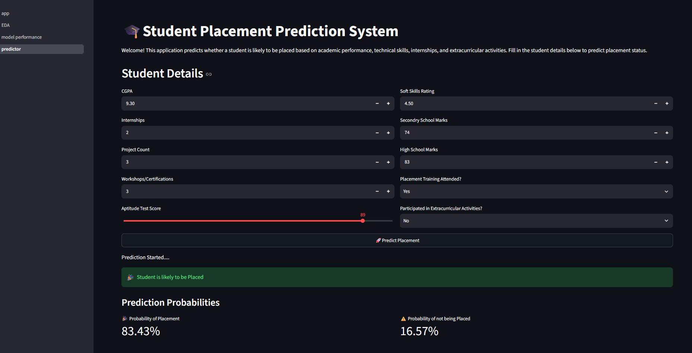
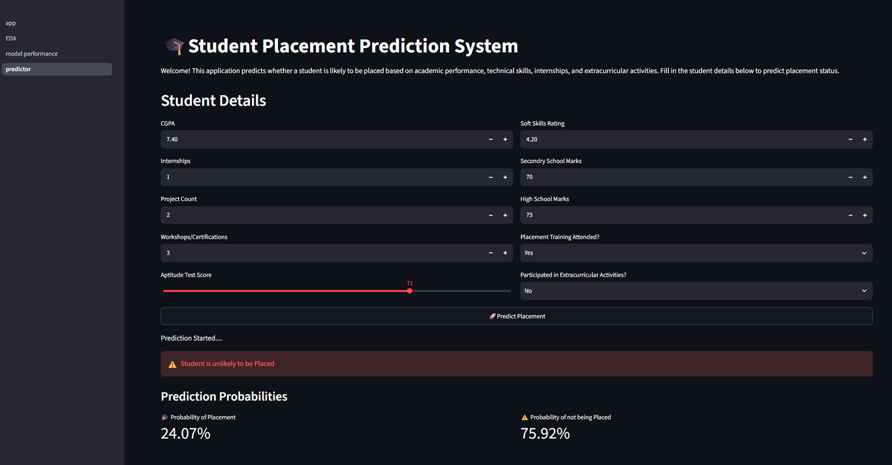

# 🎓 Student Placement Prediction System

## 📌 Project Overview

This project predicts whether a student is likely to be placed based on academic performance, internships, projects, certifications, aptitude scores, and extracurricular activities.

The system uses Machine Learning models to analyze student data and provides real-time placement predictions through a Streamlit web application connected to a FastAPI backend.

---

## 📊 Dataset Information

The dataset contains student academic and skill-related features used to predict placement status.

### Features include:
- CGPA
- Internships
- Projects
- Certifications
- Aptitude Score
- Communication Skills
- Extracurricular Activities
- Placement Training
- Academic Scores(SSC_Marks and HSC_Marks)

### Target Variable:
- Placement Status (Placed / Not Placed)

## 🚀 Features

- Data Cleaning and Preprocessing
- Exploratory Data Analysis (EDA)
- Feature Scaling
- Machine Learning Model Training
- Model Comparison
- Placement Prediction
- Probability Scores
- FastAPI Backend
- Streamlit Frontend
- Cloud Deployment

---

## 🛠️ Tech Stack

### Programming Language
- Python

### Libraries
- Pandas
- Scikit-Learn
- Matplotlib
- Seaborn
- Joblib
- streamlit

### Backend
- FastAPI
- Uvicorn

### Frontend
- Streamlit

### Deployment
- Render
- Streamlit Community Cloud
- GitHub

---

## 🤖 Machine Learning Models Used

The following machine learning models were trained and evaluated:

1. Logistic Regression
2. Decision Tree
3. Random Forest

### Model Performance

| Model | Accuracy | ROC-AUC
|---------|---------|----------|
| Logistic Regression | 79.75% |0.881|
| Decision Tree | 77.59% |
| Random Forest | 79.80% |0.873|

---
### Final Model Selection

Multiple evaluation metrics were considered, including Accuracy, Weighted F1-Score, ROC-AUC Score, and False Negatives.

Logistic Regression achieved:

- Higher ROC-AUC Score
- Better Weighted F1-Score
- Lower False Negatives
- Better overall balance between precision and recall

Therefore, Logistic Regression was selected as the final deployment model.

## 📈 Key Insights

- Students with higher CGPA, internships, Aptitude Score and projects have higher placement probability.
- Placement training significantly improves placement chances.
- Students participating in extracurricular activities show better placement outcomes.

## 📂 Project Structure

```text
Student_Placement_Prediction_System
│
├── api/
│   └── main.py
│
├── app/
│   ├── app.py
│   └── pages/
│       ├── EDA.py
│       ├── model_performance.py
│       └── predictor.py
│
├── dataset/
│   ├── placementdata.csv
│   └── Cleaned_Dataset.csv
│
├── images/
│
├── model/
│   ├── best_model.pkl
│   └── scaler.pkl
│
├── report/
│   └── model_comparison.csv
│
├── src/
│
├── requirements.txt
└── README.md
```

## ⚙️ Installation

### Clone Repository

git clone https://github.com/AnshikaSrivastava6/Student-Placement-Prediction-System

cd Student_Placement_Prediction_System

### Install Dependencies

pip install -r requirements.txt

### Run FastAPI Backend

uvicorn api.main:app --reload

### Run Streamlit Application

streamlit run app/app.py

## ▶️ Usage

1. Open the Streamlit application.
2. Enter student details such as CGPA, internships, projects, certifications, aptitude score, and academic marks.
3. Click on "Predict Placement".
4. The system sends the data to the FastAPI backend.
5. The trained Logistic Regression model generates the prediction.
6. The application displays:
   - Placement Status
   - Probability of Placement
   - Probability of Not Being Placed

## 🌐 Deployment

### Frontend (Streamlit Cloud)

https://student-placement-prediction-system-dbrl7cskj42qvctucgadgv.streamlit.app/

### Backend (Render)

https://student-placement-prediction-system-706g.onrender.com

### API Documentation

https://student-placement-prediction-system-706g.onrender.com/docs

---

## Application Screenshot

### Placement Prediction Interface




## Model Performance

The performance of different machine learning models was compared using accuracy, F1-score, and ROC-AUC.

